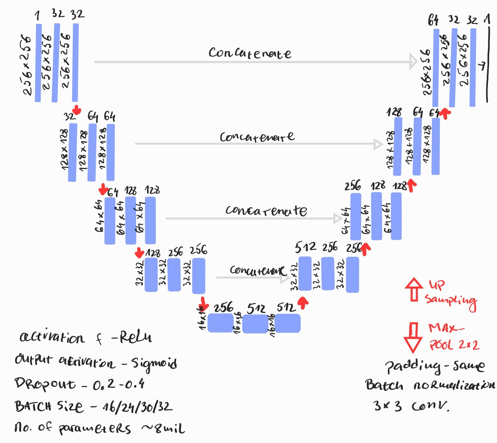
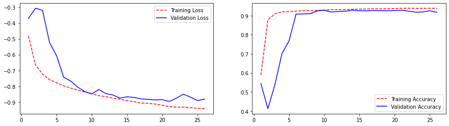
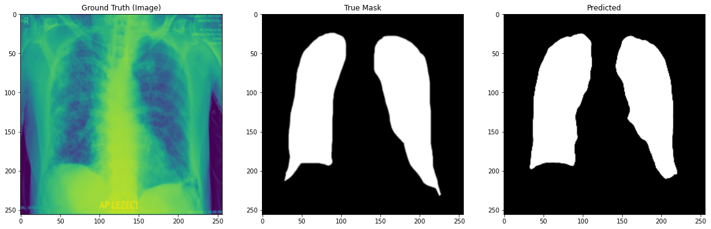

# UNET-segmentation
Here's an example of convolutional neural network with UNET architecture that's used for segmentation  of an lung X-ray medical images of COVID-19 patients.

## UNET Architecture

This is general architecture with parameters used for this problem (there is batch size of 2 missing)

## Training and validation data

For this segmentation task I had only 190 images and related mask and I splitted this data into training, validation and test set (test set contained only one image for prediction in the end), train:validation -> 80:20. 

The power of UNET architecture is noticable with a small datasets like this one. It is fast and reliable and provides a great results.

## Evaluation 
Training\Validaion and accuracy (dice coefficient) plot

For segmentation problems we can use the following metrics and losses: 
  - Pixel accuracy / Binary-crossentropy loss function
  - Jaccard index / IoU loss
  - Dice coefficient / Dice loss
  
  Since pixel accuracy isn't suited for this problem, we will take into consideration the other two metrics. (there is implementation of pixel accuracy in the code itself)
  
  The results were: 
  Jaccard coeff -> 88%
  Dice coefficient -> 87%
  
  ## Prediction
  
  
 
  References and original code (mine is combination and modification of few examples) for this problem can be found on these links:
  - https://github.com/bsamaha/Chest-Xray-FastAI/blob/master/ChestX_ray_Fastaiv1_Imgclassifier.ipynb
  - https://towardsdatascience.com/understanding-semantic-segmentation-with-unet-6be4f42d4b47
  - https://towardsdatascience.com/metrics-to-evaluate-your-semantic-segmentation-model-6bcb99639aa2
 
